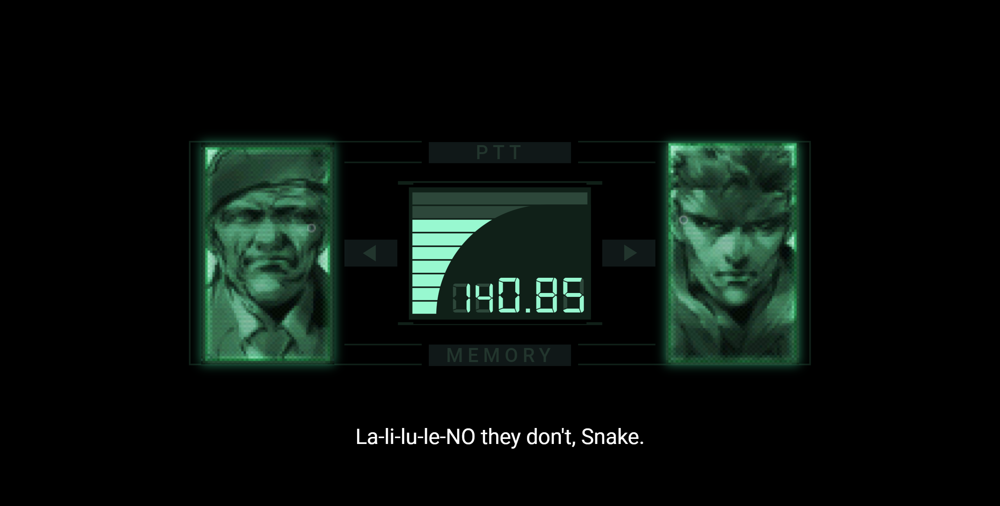

# Metal Gear Solid Interactive Codec :iphone:


### Live 
In Progress...

---

### :computer: Core - Technologies:
* [node: v14.15.0](https://nodejs.org/de/download/)
* [npm: 6.14.8](https://nodejs.org/de/download/)
* [vue/cli: 4.5.12](https://cli.vuejs.org/)
* [eslint/eslint-plugin-vue](https://github.com/vuejs/eslint-plugin-vue)
* [vuetify](https://vuetifyjs.com/en/)
* [express.js](https://expressjs.com/)

## :construction: Project setup
```
npm install
```

### Compiles and hot-reloads for development
```
npm run serve
```

### Compiles and minifies for production
```
npm run build
```

### Lints and fixes files
```
npm run lint
```

### Customize configuration
See [Configuration Reference](https://cli.vuejs.org/config/).